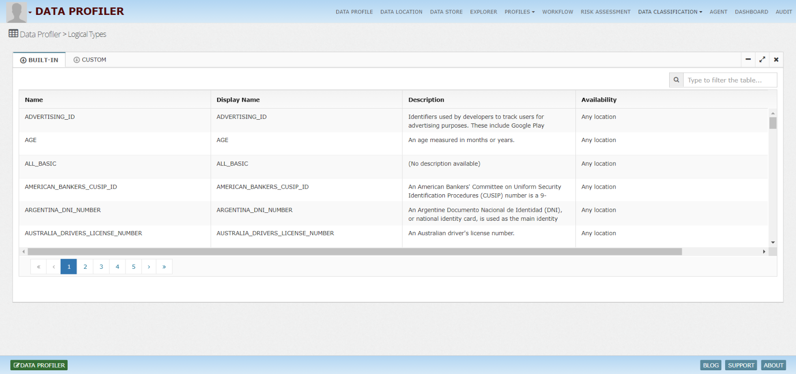

# InsightLake Data Profiler & Classification

Companies are storing lots of data and having a clear visibility of this data at the enterprise level makes the business efficient, safe and complaint. Manual profiling/classification of the data is very costly and time consuming. 
InsightLake solution enables the companies to perform the data classification using an intelligent, flexible and robust framework, which uses variety of data elemenets, glossaries, metadata coupled with business rules and ML models.

Following are the main features:
* Profiles and classifies data using rules and ML models
* Identifies personal and sensitive data
* Performs data classification leveraging glossaries, catalog, technical metadata, business tags and actual data
* Identifies data contexts and correlations to drive better accuracy
* Classifies critical data elements with enterprise defined governed classes
* Provides adapters to enrich the existing data catalog
* Handles structured, unstructured and semi structured data
* Works on-premise or cloud environments across different data sources
* Classifies files, relational databases, Object stores, No-SQL, realtime streams

## Technical data types

* Null or unsupported values
* Mean, average, min, max
* Sample values
* Logical context types like currency, OS, geo information etc.
* Sensitive data discovery like SSN, Credit card, phone number, email etc.
* Results from profiling rules
* Relationships
* Dashboard showing data element distributions, trends in automated profiling etc.

## Metadata Store
InsightLake Metadata Store enables companies to obtain metadata from various data sources like databases, files, real time streams etc and store them for easy exploration and integration with other applications.Metadata Store defines metadata layer on various data entities.

* System - represents data sources like databases, file systems etc.
* Data Location - represents database, file systems, Kafka broker, SOLR hosts etc.
* Data Store - represents table, Kafka topic, file etc.
* Data Field - represents column, data element, field etc.
* Application - represents data application
* Domain - represents data's business domain'
* User - represents data user.
* Metadata Store captures technical, operational and business domain metadata and stores them at central location for easy exploration.

## Data Profiling

Table schema, File type, format, AVRO JSON schema, tags are some of the technical information elements about data assets which Metadata Store captures and stores. Data profiling feature allows extraction of known technical metadata like data field type, size, min and max values, sample values etc. It also extracts derived information like geo, currency, business domain types etc. All types of metadata gets stored in Lucene based central store to allow fast exploration and REST based integration with other enterprise applications.

## Profiles

## Logical Types
Solution already captures different logical types, which can be easily customized and new types can be created.

## Dashboard
Proofiling & Classification dashboard provides great insights about the performance of the classification pipelines

## Audit
Profiler tracks the changes to the metadata, generated classifications, scores, tags etc. using various audit events.

## Tags & Properties
Any data element can be tagged for example a table or cell can be tagged as secure, which can then be used by security policy manager to automatically secure the access to the table or cell. Ingestion flow can be tokenized with tags, which can flow through end to end data pipeline for better lineage tracking. Other than tagging, properties (name, value) can be defined on data elements. For example on credit card column a property "Masking" with value "last 4" can be defined and used in business rules where ever data gets processed.

## Business Glossary
Metadata Store enables companies to put business context over technical metadata to provide clear business terms on top of physical data. It also increases the productivity of the enterprise. Generated glossary helps cross functional alignment between various business groups and provides a common business vocabulary across organization.

To learn more, check out [http://www.insightlake.com/data-profiler.html](http://www.insightlake.com/data-profiler.html)

## Rules
* Pre-defined rules to identify data elements
* Pattern matching rules
* Fuzzy matching rules
* Custom scripted rules
* ML driven rules

## ML Classification
ML based data classification/profiling is done using a set of hierarchical models. High level models perform context classification and route the data to appropriate ensemble models for further fine grained classification. 
ML framework is flexible and plugs in off the shelf and custom models.

Following models are used for classification
* Context classifiers
* Co-relational models
* NLP models for text classification, topic modeling for emails, chat, documents
* Image classifiers 
* Audio classification & keywords models

## UI
* Allows exploration/search of the generated classifications
* Allows correction of the classification, which could be reused to train models
* Administration of rules, profiles and workflows
* Allows exploration of audits

Installation
------
* Download or clone the repository. 
* Run bin/insightlake command.
* Open browser with URL as http://localhost:8080/
* Change configuration in /conf folder to set different ports
* By default H2 database is used, you can change the database details in jdbc.properties file

Installation using docker 
------
* Download or clone the repository. 
* cd /docker
* Run `docker-compose -f docker-compose.yaml up --build`
* Open browser with URL as http://localhost:8080/
* While creating Data Location use below credentials  

        * username : root
        * password : password
        * URL :  jdbc:mysql://mysql:3306/

License
------
InsightLake Data Profiler is a commercial product but distributed to be used freely. Please contact contact@insightlake.com for details.

Getting Help
----------

You can get help easily :
Community - Google Groups
Slack Channel
Twitter
Facebook
Email: contact@insightlake.com
