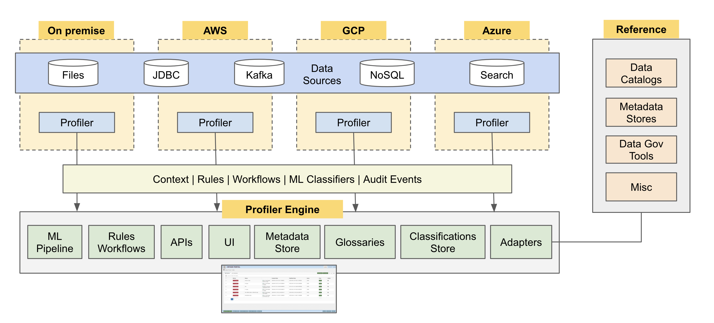
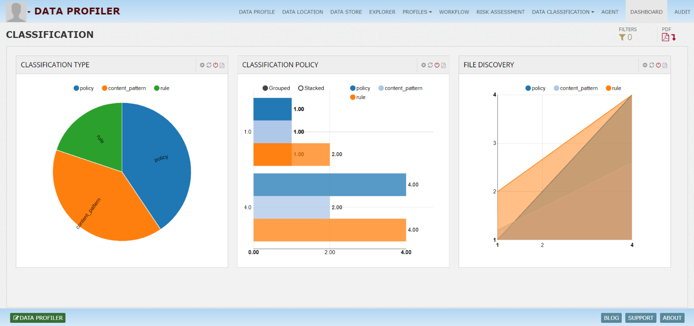

# Data-Profiler

Data discovery and profiling is the key feature to understand the data and its elements. Profiling exposes data quality issues. Data profiling on sample or complete data will allow data administrators to see following details:

## Technical data types

Null or unsupported values
Mean, average, min, max
Sample values
Logical context types like currency, OS, geo information etc.
Sensitive data discovery like SSN, Credit card, phone number, email etc.
Results from profiling rules
Relationships
Dashboard showing data element distributions, trends in automated profiling etc.

## InsightLake Metadata Store enables companies to obtain metadata from various data sources like databases, files, real time streams etc and store them for easy exploration and integration with other applications.
Metadata Store defines metadata layer on various data entities.

System - represents data sources like databases, file systems etc.
Data Location - represents database, file systems, Kafka broker, SOLR hosts etc.
Data Store - represents table, Kafka topic, file etc.
Data Field - represents column, data element, field etc.
Application - represents data application
Domain - represents data's business domain'
User - represents data user.
Metadata Store captures technical, operational and business domain metadata and stores them at central location for easy exploration.

## Technical Metadata

Table schema, File type, format, AVRO JSON schema, tags are some of the technical information elements about data assets which Metadata Store captures and stores. Data profiling feature allows extraction of known technical metadata like data field type, size, min and max values, sample values etc. It also extracts derived information like geo, currency, business domain types etc. All types of metadata gets stored in SOLR based central store to allow fast exploration and REST based integration with other enterprise applications.

## Profiles

You can use profiles to create and persist configuration information to use with Cloud Data Loss Prevention (DLP). Profiles are useful for decoupling configuration information such as what you inspect for and how you de-identify it from the implementation of your requests. Profiles provide a robust way to manage large scale rollouts of Cloud DLP capabilities.

## Logical Types

 An logicalType is a type of sensitive data, such as a name, email address, telephone number, identification number, or credit card number.

## Dashboard

You can show the data in analytical and graphical format by using charts

## Audit

## Data Classification 
Data classification allows your users to assign a visual label to the data they create, so that informed decisions can be taken about how it is managed, protected and shared, both within and outside of your organisation. Classifier turns that visual label into metadata, which can be used to both enforce your company’s security policies and drive other technologies, such as data loss prevention, information rights management and archiving solutions.
* Scale And Coverage For The Modern Enterprise
* ML-Driven Classification
* Correlation Plus Classification
* Cataloging Plus Classification
* Intelligent Labeling And Tagging

## Tags & Properties
Any data element can be tagged for example a table or cell can be tagged as secure, which can then be used by security policy manager to automatically secure the access to the table or cell. Ingestion flow can be tokenized with tags, which can flow through end to end data pipeline for better lineage tracking. Other than tagging, properties (name, value) can be defined on data elements. For example on credit card column a property "Masking" with value "last 4" can be defined and used in business rules where ever data gets processed.

## Business Glossary
Metadata Store enables companies to put business context over technical metadata to provide clear business terms on top of physical data. It also increases the productivity of the enterprise. Generated glossary helps cross functional alignment between various business groups and provides a common business vocabulary across organization.

To learn more, check out [http://www.insightlake.com/data-profiler.html](http://www.insightlake.com/data-profiler.html)

Installation
------
* Download or clone the repository. 
* Run bin/insightlake command.
* Open browser with URL as http://localhost:8080/
* Change configuration in /conf folder to set different ports
* By default H2 database is used, you can change the database details in jdbc.properties file

Installation using docker 
------
* Download or clone the repository. 
* cd /docker
* Run `docker-compose -f docker-compose.yaml up --build`
* Open browser with URL as http://localhost:8080/
* While creating Data Location use below credentials  

        * username : root
        * password : password
        * URL :  jdbc:mysql://mysql:3306/

License
------
InsightLake Data Profiler is a commercial product but distributed to be used freely. Please contact contact@insightlake.com for details.

Getting Help
----------

You can get help easily :
Community - Google Groups
Slack Channel
Twitter
Facebook
Email: contact@insightlake.com
