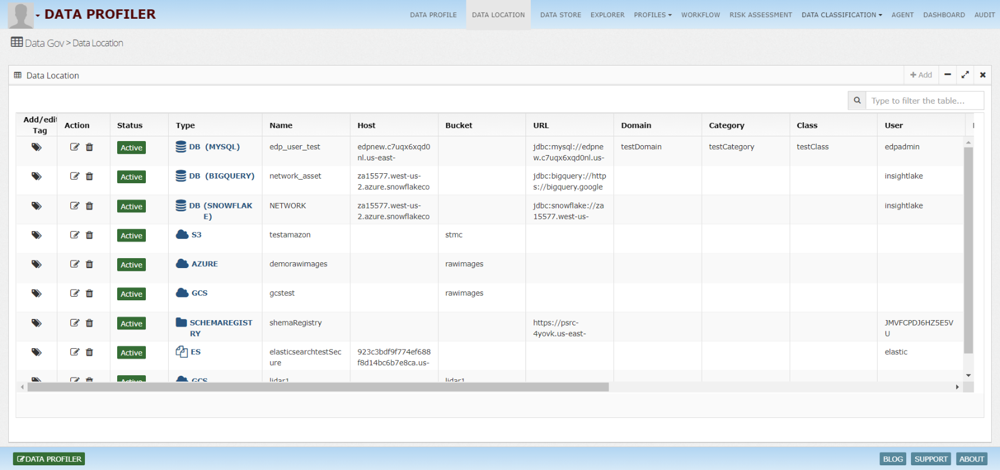
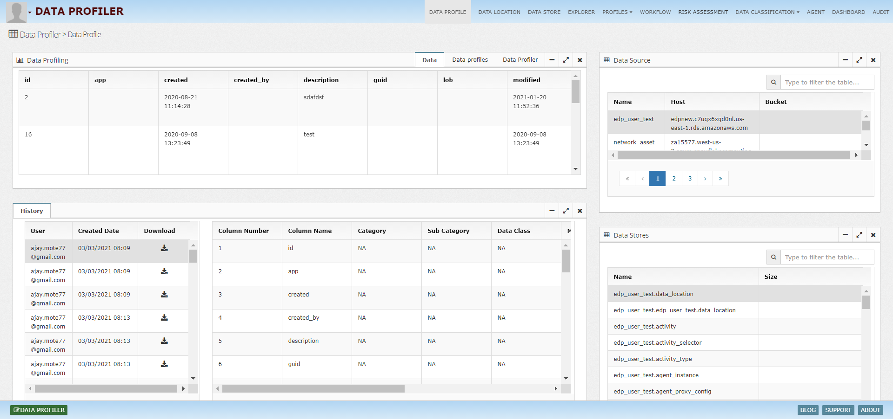

# InsightLake Data Profiler & Classification

Companies are storing lots of data and having a clear visibility of this data at the enterprise level makes the business efficient, safe and compliant. 

Team should be able to clearly identify the classification of the data, following are the important categories:
* Identify confidential, personal, sensitive or public data
* Identify critical data elements defined by enterprise governance teams
* Classify the data if it meets compliance (GDPR, HITRUST, HIPAA..) needs

This classification will drive different segments like data quality, governance and analytics.

Manual profiling/classification of the data is very costly and time consuming. InsightLake solution enables the companies to perform the data classification using an intelligent, flexible and robust framework, which uses a variety of data elements, glossaries, metadata coupled with business rules and ML models.
 
## InsightLake Data Profiler Solution

Following are the main features of InsightLake solution:
* Profiles and classifies data using rules and ML models
* Identifies personal and sensitive data
* Performs data classification leveraging glossaries, catalog, technical metadata, business tags and actual data
* Identifies data contexts and correlations to drive better accuracy
* Classifies critical data elements with enterprise defined governed classes
* Provides adapters to get the data from catalog or business systems and enrich them with generated classification
* Handles structured, unstructured and semi structured data (CSV, Excel, Audios, Images, Videos, Text, Docs, PDFs etc.)
* Works on-premise or cloud environments across different data sources
* Classifies files, relational databases, Object stores, No-SQL, realtime streams

## Architecture
InsightLake solution is deployed in a distributed manner with different components. Below diagram shows the high level architecture.

Following are the main components of the solution:
* Classification Manager (Profiler Engine) - Centrally installed
* Profiler - Distributed closer to the data
 
### Classification Manager
Classification manager is a central core engine, which provides following functionality:

UI - Interactive web console
Core Engine - central engine for coordination
ML Solution - Pipelines, Notebooks, Labeling Environment, Model repo and catalog
Classification - Exploration of classification and correction
APIs - Enable external applications to retrieve classifications, profiles, workflows etc.
Big Data stores - storing audits, classifications and other data artifacts

### Profiler
Below diagram shows the high level architecture of the profiler. Multiple instances of profilers can be deployed on-premise or cloud environments and they connect to the centralized classification manager.

Profiler does the following:
* Loads assigned data profiles, workflows, policies and rules from the Classification manager
* Initiates the data and technical metadata collection from source systems using various data connectors
* Connects to the data catalog and glossaries systems or relies on Classification manager to provide them
* In case of unstructured and semi-structured data performs pre-processing of the data. For example converting scanned documents to text using OCR, converts audio to text, applies NLP models to text and documents, runs entity/keyword models to gather entities from images and videos etc. This metadata is then used in the later stages of profiling/classification.
* Performs data profiling to get the statistical distribution of the data and categorization of the data types
* Builds a Data graph to hold rich information about data, metadata, lineage etc.
* In case of structured data performs high level contextual analysis using rules and models
* Performs field level analysis using fuzzy matching rules and ML models
* Performs data correlation analysis using clustering models
* Gathers or performs lineage analysis
* Performs holistic classification determination using tiered layers and models to provide confidence levels for a set of predictions.
* Runs classification workflows periodically or on demand basis
* Captures profiling/classification change history
* Capture operational and data audits
 
### UI
Interactive web console allows easy exploration of generated profiles/classifications, audits etc and management of policies, workflows and rules. Following are some of the screenshots.

* Allows exploration/search of the generated classifications
* Allows correction of the classification, which could be reused to train models
* Administration of rules, profiles and workflows
* Allows exploration of audits

#### Data Location
Central place to set up different data locations for sources like Oracle, MySQL, FTP, Big Query, S3, Redshift, Kafka, MongoDB, DB2 etc..

#### Data Store
Represents data stores present at the location like tables, files etc.

#### Data Profiler
Presents the profiled data and its statistical variations

#### Rules
Central place to define rules for a give profile

#### Data Profile
Context to store rules

#### Logical Types
Set of logical types for data fields, these types drive pre-existing matching rules. Custom types can easily be created as well.

## Classification

## DLP Classification Search

## Workflow

## Agents

## Category

## SubCategory

## Domains

## Mappings

## Class

## Dashboard
Profiling & Classification dashboard provides great insights about the performance of the classification pipelines

## Audit
Profiler tracks the changes to the metadata, generated classifications, scores, tags etc. using various audit events.

## Rules
* Pre-defined rules to identify data elements
* Pattern matching rules
* Fuzzy matching rules
* Custom scripted rules
* ML driven rules

## ML Classification
ML based data classification/profiling is done using a set of hierarchical models. High level models perform context classification and route the data to appropriate ensemble models for further fine grained classification. 
ML framework is flexible and plugs in off the shelf and custom models.

Following models are used for classification
* Context classifiers
* Co-relational models
* NLP models for text classification, topic modeling for emails, chat, documents
* Image classifiers 
* Audio classification & keywords models

To learn more, check out [http://www.insightlake.com/data-profiler.html](http://www.insightlake.com/data-profiler.html)

Installation
------
* Download or clone the repository. 
* Run bin/insightlake command.
* Open browser with URL as http://localhost:8080/
* Change configuration in /conf folder to set different ports
* By default H2 database is used, you can change the database details in jdbc.properties file

Installation using docker 
------
* Download or clone the repository. 
* cd /docker
* Run `docker-compose -f docker-compose.yaml up --build`
* Open browser with URL as http://localhost:8080/
* While creating Data Location use below credentials  

        * username : root
        * password : password
        * URL :  jdbc:mysql://mysql:3306/

License
------
InsightLake Data Profiler is a commercial product but distributed to be used freely. Please contact contact@insightlake.com for details.

Getting Help
----------

You can get help easily :
Community - Google Groups
Slack Channel
Twitter
Facebook
Email: contact@insightlake.com
